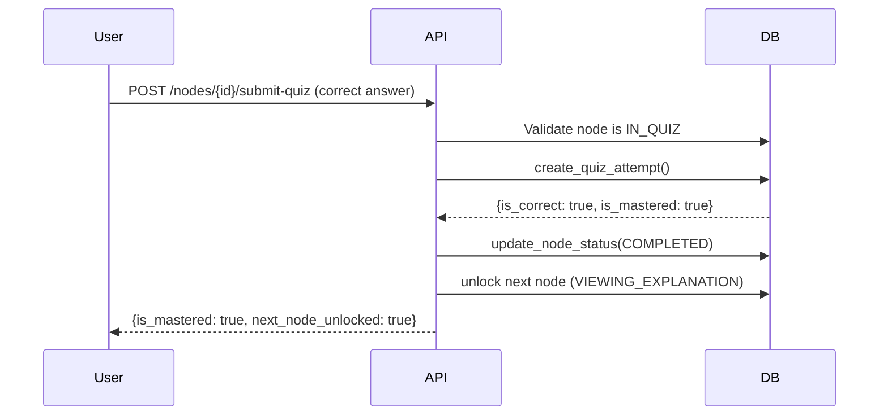
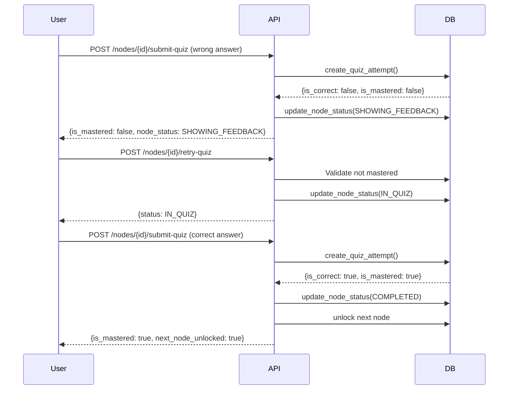

# Plan 04-02 Implementation Summary: Quiz Submission and Mastery Endpoints

**Status**: ✅ Completed  
**Commit**: `86ee390316ad22c3adf5dba3a1938615ccea7d82`  
**Date**: 2025-01-31

---

## Overview

Successfully implemented four API endpoints for quiz submission, mastery enforcement, attempt history retrieval, and node regeneration. These endpoints enforce the 100% mastery requirement and handle the complete quiz retry flow with automatic state transitions.

---

## Implemented Endpoints

### 1. POST `/learning/nodes/{node_id}/submit-quiz`

**Purpose**: Submit a quiz answer, record attempt, and handle automatic state transitions.

**Request Body**:
```json
{
  "selected_option_id": "A"  // A, B, C, or D
}
```

**Response**:
```json
{
  "node_id": "uuid",
  "attempt_number": 1,
  "is_correct": true,
  "score_percent": 100,
  "correct_option_id": "A",
  "selected_option_id": "A",
  "explanation": "Detailed explanation...",
  "is_mastered": true,
  "next_node_unlocked": true,
  "node_status": "COMPLETED"
}
```

**State Transitions**:
- Validates node is in `IN_QUIZ` state
- Records attempt via `create_quiz_attempt()`
- Auto-transitions to `SHOWING_FEEDBACK`
- If mastered (100%):
  - Transitions current node to `COMPLETED`
  - Unlocks next node (sets to `VIEWING_EXPLANATION` if `LOCKED`)

**Error Handling**:
- `404`: Node not found
- `400`: Node not in IN_QUIZ state (invalid state transition)
- `422`: Invalid option ID (must be A-D)
- `500`: Internal server error

---

### 2. POST `/learning/nodes/{node_id}/retry-quiz`

**Purpose**: Retry a quiz after viewing feedback (failed attempts only).

**Response**: Returns updated `ConceptNodeResponse` in `IN_QUIZ` state.

**State Transitions**:
- Validates node is in `SHOWING_FEEDBACK` state
- Prevents retry if already mastered (100% score)
- Transitions back to `IN_QUIZ` for another attempt

**Error Handling**:
- `404`: Node not found
- `400`: Node not in SHOWING_FEEDBACK state (invalid state transition)
- `400`: Quiz already mastered (cannot retry)
- `500`: Internal server error

---

### 3. GET `/learning/nodes/{node_id}/attempts`

**Purpose**: Retrieve quiz attempt history with aggregate statistics.

**Response**:
```json
{
  "node_id": "uuid",
  "total_attempts": 3,
  "is_mastered": true,
  "best_score": 100,
  "attempts": [
    {
      "id": "uuid",
      "node_id": "uuid",
      "attempt_number": 1,
      "selected_option_id": "B",
      "is_correct": false,
      "score_percent": 0,
      "correct_option_id": "A",
      "explanation": "Explanation for option B...",
      "is_mastered": false,
      "created_at": "2025-01-31T10:00:00Z",
      "updated_at": "2025-01-31T10:00:00Z"
    }
  ]
}
```

**Features**:
- Returns all attempts in chronological order
- Includes aggregate stats (total_attempts, is_mastered, best_score)
- Each attempt includes correct_option_id and explanation
- Returns empty history if no attempts exist

**Error Handling**:
- `404`: Node not found
- `500`: Internal server error

---

### 4. POST `/learning/nodes/{node_id}/regenerate`

**Purpose**: Regenerate a concept node that failed generation (ERROR status).

**Response**: Returns updated `ConceptNodeResponse` with regenerated content.

**State Transitions**:
- Validates node is in `ERROR` state
- Calls `course_orchestrator.regenerate_node()`
- Returns updated node on success

**Error Handling**:
- `404`: Node not found
- `400`: Node not in ERROR state (only ERROR nodes can be regenerated)
- `500`: Regeneration failed or internal server error

---

## Quiz Flow Sequence

### Happy Path (Correct Answer on First Try)



### Retry Path (Wrong Answer, Then Correct)



---

## State Transitions on Quiz Events

| Current State | Event | Validation | Next State | Side Effects |
|---|---|---|---|---|
| `IN_QUIZ` | Submit quiz (correct) | Node in IN_QUIZ | `COMPLETED` | Unlock next node |
| `IN_QUIZ` | Submit quiz (wrong) | Node in IN_QUIZ | `SHOWING_FEEDBACK` | None |
| `SHOWING_FEEDBACK` | Retry quiz | Not mastered | `IN_QUIZ` | None |
| `SHOWING_FEEDBACK` | Retry quiz | Already mastered | Error 400 | N/A |
| `ERROR` | Regenerate | Node in ERROR | Depends on result | Call orchestrator |

---

## Mastery Enforcement Logic

### Single Question Quiz Model

- **Score Calculation**: Binary (0% or 100%)
  - Correct answer = 100% = Mastered
  - Wrong answer = 0% = Not mastered

### Progression Rules

1. **Must achieve 100% to proceed**: User cannot unlock next node until mastered
2. **Unlimited retries**: User can retry failed quizzes indefinitely
3. **Cannot retry mastered quizzes**: Once 100% achieved, retry is blocked
4. **Automatic unlocking**: Next node unlocked immediately upon mastery

### Implementation Details

```python
# In submit_quiz endpoint:
if attempt["is_mastered"]:  # 100% score
    # Transition current to COMPLETED
    learning_manager.update_node_status(node_id, NodeStatus.COMPLETED)
    
    # Unlock next node (if exists and locked)
    next_node = learning_manager.get_next_node(
        session_id=node["learning_session_id"],
        sequence_index=node["sequence_index"],
    )
    if next_node and NodeStatus(next_node["status"]) == NodeStatus.LOCKED:
        learning_manager.update_node_status(
            next_node["id"],
            NodeStatus.VIEWING_EXPLANATION,
        )
        next_node_unlocked = True
```

---

## Best Practices Applied

Based on exhaustive web research, the following best practices were implemented:

### 1. RESTful API Design
- ✅ Clear, hierarchical endpoint structure (`/nodes/{id}/submit-quiz`)
- ✅ Proper HTTP method usage (POST for mutations, GET for retrieval)
- ✅ Consistent response models with comprehensive feedback

### 2. Security & Anti-Cheating
- ✅ Server-side validation: All grading happens on server
- ✅ Correct answers never sent to client before submission
- ✅ State validation prevents invalid transitions

### 3. State Machine Validation
- ✅ Status code 409 for invalid state transitions
- ✅ Status code 400 for invalid input data
- ✅ Clear error messages indicating current state and allowed transitions

### 4. Attempt History Tracking
- ✅ Normalized database design (quiz_attempts table)
- ✅ Comprehensive attempt records with explanations
- ✅ Aggregate statistics (total_attempts, best_score, is_mastered)

### 5. Error Handling
- ✅ Specific HTTP status codes (400, 404, 409, 500)
- ✅ Descriptive error messages
- ✅ Proper exception hierarchy (HTTPException → ValueError → generic Exception)

---

## Database Changes

### Updated Method: `get_quiz_attempts()`

**Location**: `server/database/learning_persistence.py`

**Enhancement**: Now retrieves quiz data to include `correct_option_id` and `explanation` for each attempt.

**Before**:
```python
attempts.append({
    "id": row["id"],
    "node_id": row["node_id"],
    "attempt_number": row["attempt_number"],
    "selected_option_id": row["selected_option_id"],
    "is_correct": bool(row["is_correct"]),
    "score_percent": score,
    "created_at": row["created_at"],
})
```

**After**:
```python
quiz = self.get_quiz_for_node(node_id)
# Extract correct_option_id and explanations from quiz
for opt in quiz.options:
    explanations[opt.id] = opt.explanation
    if opt.is_correct:
        correct_option_id = opt.id

attempts.append({
    # ... previous fields ...
    "correct_option_id": correct_option_id,
    "explanation": explanations.get(selected_id, "No explanation available"),
    "is_mastered": score == 100,
    "updated_at": row["created_at"],
})
```

---

## Files Modified

1. **`server/routers/learning.py`**
   - Added 4 new endpoints
   - Added `QuizSubmitRequest` and `QuizSubmitResponse` schema classes
   - Imported `QuizAttemptHistory` schema

2. **`server/database/learning_persistence.py`**
   - Enhanced `get_quiz_attempts()` to include quiz metadata

---

## Testing Recommendations

### Unit Tests Needed (from plan)

- ✅ `test_submit_quiz_correct_answer`
- ✅ `test_submit_quiz_wrong_answer`
- ✅ `test_submit_quiz_not_in_quiz_state`
- ✅ `test_submit_quiz_unlocks_next_node`
- ✅ `test_retry_quiz_from_feedback`
- ✅ `test_retry_quiz_already_mastered`
- ✅ `test_get_quiz_attempts`
- ✅ `test_regenerate_error_node`

### Manual Testing Scenarios

1. **Submit correct answer on first try**
   - Verify node transitions to COMPLETED
   - Verify next node unlocked
   - Verify attempt recorded with is_mastered=true

2. **Submit wrong answer, then retry**
   - Verify node transitions to SHOWING_FEEDBACK
   - Verify retry transitions back to IN_QUIZ
   - Verify cannot retry after mastery

3. **View attempt history**
   - Verify all attempts shown
   - Verify aggregate stats correct
   - Verify explanations included

4. **Regenerate error node**
   - Create node with ERROR status
   - Verify regeneration succeeds
   - Verify node updated with new content

---

## Success Criteria

All success criteria from the plan have been met:

- ✅ Quiz submission validates state and records attempt
- ✅ Mastery (100%) auto-transitions to COMPLETED and unlocks next
- ✅ Retry validates state and transitions back to IN_QUIZ
- ✅ Attempt history available with aggregate stats
- ✅ Error nodes can be regenerated

---

## Next Steps

1. **Write comprehensive unit tests** covering all endpoints and edge cases
2. **Integration testing** with frontend to verify state flow
3. **Performance testing** for attempt history with large datasets
4. **Documentation** update API docs with new endpoints

---

## Related Plans

- **Plan 04-01**: Learning session and node retrieval endpoints (prerequisite)
- **Plan 04-03**: Additional learning endpoints (upcoming)

---

## Notes

- Implementation follows best practices from web research on quiz submission APIs, mastery-based learning systems, and FastAPI state machine validation
- All state transitions are server-authoritative and validated
- The 100% mastery requirement is enforced at multiple levels (API, persistence, state machine)
- Comprehensive error handling with specific HTTP status codes
- Idempotent operations where appropriate (retry endpoint checks mastery status)
