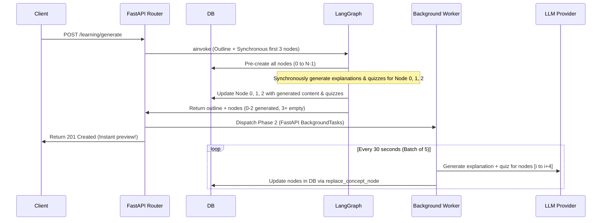

# Plan: Two-Phase Course Generation for Concurrency & Rate-Limit Management

## Context & Objectives
During course generation, the planner typically creates 30–40 topics. Fanning out 30–40 concurrent LLM API requests results in rate-limiting (429 HTTP errors, TPM/RPM limits exceeded) and synchronous timeouts (browser/gateway timeouts exceeding 60–120 seconds).

To address these limitations, we will implement a **Two-Phase Generation Flow**:
1. **Phase 1 (Synchronous Fast-Path)**:
   - Generate the course outline.
   - Pre-create all topic nodes in the database as `LOCKED` (with empty content).
   - Generate explanation content and quizzes for only the **first 3 topics** synchronously using the existing LangGraph pipeline.
   - Return the session and all nodes (3 completed, rest empty/locked) to the user immediately.
2. **Phase 2 (Asynchronous Background Batches)**:
   - Queue the remaining topics (nodes 4 to N) for background generation.
   - Process them in batches of **5 nodes every 30 seconds** to stay well within the provider's rate limits.
   - Update node content, status, and quiz data in the database as they complete.

---

## High-Level Workflow



---

## Detailed Step-by-Step Implementation

### Step 1: Pre-populate Concept Nodes in Planner Node
Currently, `concept_nodes` are created dynamically in `quizzer_node` or error handlers. We will update [planner_node](file:///D:/Peter/A2UI/server/graph/nodes.py#L109) to pre-create all concept nodes in the database immediately after creating the session.

- **Status Mapping**:
  - Index 0: `NodeStatus.VIEWING_EXPLANATION`
  - Index > 0: `NodeStatus.LOCKED`
- **Initial Values**:
  - `content_markdown` = `""`
  - No quiz data.

We will add a helper method or use `learning_manager.create_concept_node` to batch-insert these placeholders.

### Step 2: Modify LangGraph Nodes to Update Existing Nodes
Since nodes will already exist in the database, `quizzer_node` and its error handlers must update existing records rather than creating new ones.
- Replace `learning_manager.create_concept_node` calls in [nodes.py](file:///D:/Peter/A2UI/server/graph/nodes.py) with calls that look up the existing node by `session_id` and `sequence_index`, then use `learning_manager.replace_node_content` or `update_node_content`.

### Step 3: Fast-path Fan-out
In [fan_out_generators](file:///D:/Peter/A2UI/server/graph/nodes.py#L183), we will limit the fanned-out `Send` packets to the first 3 nodes (`index < 3`).
- Nodes with `index >= 3` will bypass the synchronous generation loop.

### Step 4: Implement Background Worker for Phase 2
In [routers/learning.py](file:///D:/Peter/A2UI/server/routers/learning.py), we will add a background task function:

```python
async def _generate_remaining_nodes_bg(
    session_id: str,
    topics_to_generate: list[dict],
    llm_context: LLMContext,
):
    """
    Process remaining topics in batches of 5.
    Wait 30 seconds between batches to avoid rate limits.
    """
    # Batch size = 5, sleep = 30s
    for i in range(0, len(topics_to_generate), 5):
        batch = topics_to_generate[i:i+5]
        tasks = []
        for topic_data in batch:
            tasks.append(_generate_single_node_bg(session_id, topic_data, llm_context))
        
        # Run batch concurrently
        await asyncio.gather(*tasks, return_exceptions=True)
        
        # Wait 30 seconds if there are more batches left
        if i + 5 < len(topics_to_generate):
            await asyncio.sleep(30)
```

For each node:
- Generate explanation using `generator_agent.generate_explanation`.
- Generate quiz set using `quizzer_agent.generate_quiz_set`.
- Update the concept node in the DB via `learning_manager.replace_node_content` (clearing any pending/locked state).
- Handle failures gracefully: if an exception occurs, write a partial failure with `NodeStatus.ERROR` and `retry_available=True` so that the user can retry generating that node individually.

### Step 5: Update the `/generate` Route
Modify the route to:
- Call the graph (which now returns quickly after generating the first 3 nodes).
- Retrieve the full list of nodes from the database (both generated and placeholder nodes).
- Dispatch the background task for the remaining topics (`index >= 3`) using FastAPI's `BackgroundTasks`.
- Return the session and nodes.

---

## Edge Cases & Mitigation

| Edge Case | Impact | Solution |
|---|---|---|
| **Background generation fails** | Node stuck | Catch exception in background worker, mark node status as `ERROR` and `retry_available=True`. User can retry generating it individually from the UI. |
| **User completes first 3 nodes before background finishes** | Blocking progress | With 5 nodes generated every 30 seconds, the user will have access to more content long before they can finish reading/quizzing the first 3. |
| **Duplicate generation** | Race condition | Ensure background task checks if a node is already generated (non-empty `content_markdown`) before invoking the LLM. |
| **API cancellation / session delete** | Orphaned bg tasks | The background task will check if the session still exists in the database before starting each batch; abort if deleted. |
