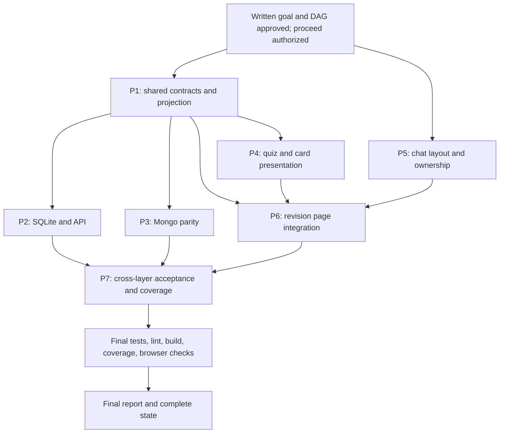

# State & Dependency Graph: Completed-Course Review Parity

## Workflow configuration

- Invocation: `/maw --skip research,review`, using the existing feature objective.
- Workspace: `D:/Peter/Personal Stuffs/A2UI`; shell: PowerShell.
- Keep all workflow artifacts directly in `docs/completed-course-review-parity/`.
- Research and unified code review alone are skipped, as explicitly requested.
  Do not create `research.md`/`review.md` or dispatch researcher/reviewer agents.
- Brainstorming, planning, test-first worker execution, defect resolution when
  verification finds defects, and final verification/reporting remain required.
- Current authorization is full dispatch of this DAG. The user approved the
  written specification and this dependency graph on 2026-10-05 and authorized
  planners and workers to run. Approval covers this objective only; it grants no
  authority over other workflow directories.
- Main orchestrator manages approvals, documentation, DAG, dispatch, and final
  verification only. It never implements application code directly.
- Orchestrator must not read `research.md` or `plan*.md`. Verify future plans via
  `git log -1 --stat <reported-commit>` and use planner/worker summary reports.
- The working tree was clean at initialization. Preserve all subsequent user
  changes, including work associated with other workflow directories. Do not
  resume or modify the real-time course-generation workflow as part of this task.
- No isolated worktree was requested. Future agents share this checkout under
  the ownership and commit-serialization rules below.
- `dag_status: complete` means the dependency graph is fully defined, not that
  planning or implementation has happened. All seven plans remain undispatched.

## Workflow milestones

- [x] Step 1: Brainstorming & Goal Alignment (`goal.md` approved by the user on
  2026-10-05; written specification and 7-plan DAG authorized for dispatch).
- [x] Step 2: Technical Research (Skipped via `--skip research`).
- [ ] Step 3: Planning Completed (`plan1.md` and `plan5.md` written and committed;
  `plan2.md`, `plan3.md`, `plan4.md`, `plan6.md`, `plan7.md` pending).
- [ ] Step 4: Execution Completed (P1 and P5 complete and independently verified;
  P2, P3, P4, P6, P7 outstanding).
- [x] Step 5: Unified Code Review (Skipped via `--skip review`).
- [ ] Step 6: Final Verification & Report (`verification.md`, `final_report.md`).

Checked skipped milestones record configuration only; they are not evidence of
research, review, code execution, or verification.

## Brainstorming tasks

- [x] Explore project context: seven repository specs, relevant client/server
  source, recent commits, and clean git state.
- [x] Clarify disclosure policy and mode-specific completion with the user.
- [x] Compare targeted UI sharing, independent patches, and complete unification.
- [x] Present recommended design and obtain behavioral approval.
- [x] Write and commit `goal.md`: `3667545`.
- [x] Self-check the specification for scope, ambiguity, and consistency.
- [x] Construct complete DAG, file ownership, prerequisites, acceptance mapping,
  evidence requirements, and resume procedure in this state.
- [x] Record research/review skips and explicit pause on 2026-10-05.
- [x] Obtain user approval of the written specification and DAG, and permission
  to begin the pipelined workflow (granted 2026-10-05).

## Initial findings

- Revision is a separate route/card, not the original learning state machine.
  Full Review puts quizzes below content; Practice is quiz-only.
- The client expects result identity, selected IDs, score, and attempt details
  which the current revision response schema/repositories omit. Missing
  `node_id` breaks the result-cache key.
- The page stores a single result per topic and the card does not match feedback
  to the active quiz index. Topic status is incorrectly used for quiz color.
- Both stores preserve a topic-wide pass after one correct answer. Optimistic
  mutation code assumes correctness before the server responds.
- Existing attempts store `revision_session_id`, `node_id`, `quiz_index`, and
  selected stable IDs, allowing scoped restoration without a new attempt table.
- `reviewed_at` and the old status are overloaded. A quiz-derived timestamp
  cannot establish an explicit content-review action.
- Original attempt-history/mastery queries include paths that do not filter out
  revision attempts. Fix scope narrowly to preserve original learning behavior.
- Normal learning already provides detailed feedback, curiosity parsing/buttons,
  heading-chat context, and a resizable split container for `ChatPanel`.
- Revision renders the in-flow chat component outside that split container,
  explaining the observed bottom-left/below-content positioning.
- Chat currently has completion-triggered clearing semantics. Revision must not
  accidentally clear history when reading/practice completion changes.
- SQLite and Mongo operate through repository facades and must stay in parity.
  Do not bypass those facades or require a new Mongo transaction capability.
- Baseline automated test results have not been measured for this workflow.
  Only documentation checks have run; no pass/fail baseline is claimed.

## Confirmed product decisions

- Match normal disclosure: selected-option explanations and retry when wrong;
  all option explanations when correct.
- Correctness is per quiz: gray unanswered, green latest correct, red latest
  incorrect. A single correct answer never colors the whole topic card green.
- Full Review completes reading through Mark as Reviewed, independently of quiz
  performance. Practice completes coverage only after every quiz is submitted.
- Skipping a quiz creates no attempt and does not complete its coverage.
- Keep Full Review's content-then-quiz layout and Practice's quiz-only layout.
- Restore submitted feedback across navigation/refresh within the same revision.
- Restore clickable curiosity-question prefill without auto-sending.
- Match normal right-hand chat behavior and preserve explicit topic ownership.
- Original course mastery/progress/content remain unchanged by revision actions.
- Targeted sharing is preferred over rewriting both complete course flows.
- Research and unified review are skipped; planning, execution, tests, build,
  lint, coverage verification, browser checks, and final reporting are not.

Detailed choices such as legacy normalization, explicit View Summary, scoring
labels, and responsive thresholds are recorded in `goal.md` for written-spec
approval. They are not independently assumed to be approved by the conversion.

## Dependency matrix & execution status

`G` means written-goal/DAG approval and authorization to proceed. Research is
skipped, so there is no `R` prerequisite. A `P#` worker dependency means that
worker's relevant code/tests are verified, committed, and reported complete.
Planner readiness is separate from worker readiness so planning can overlap
execution. No table entry authorizes dispatch while the workflow is paused.

| Plan ID | Title & scope | Worker dependencies | Files / subsystems | Planner status | Worker status | Commits |
| --- | --- | --- | --- | --- | --- | --- |
| **P1** | Shared revision contracts and pure progress/result projection | G | Pydantic/TS contracts, repository protocol, shared domain helpers/tests | `[x]` `074ce34` | `[x]` Complete | `34f01e5` `dac308a` `05e13f0` `fffaf88` `24a882d` `b0eb4ce` |
| **P2** | SQLite persistence, compatibility, and serialized revision API | P1 | SQLite LearningManager, revision router handlers, SQL/API tests | Pending; not dispatched | Pending; not dispatched | None |
| **P3** | Mongo parity, compatibility, and storage migration preservation | P1 | Mongo learning repository, migration preservation, Mongo tests | Pending; not dispatched | Pending; not dispatched | None |
| **P4** | Shared option feedback and controlled revision card/quiz UI | P1 | Shared feedback renderer, revision quiz/card, state helpers/tests | Pending; not dispatched | Pending; not dispatched | None |
| **P5** | Reusable split chat layout, prefill, and conversation ownership | G | Chat layout/controller, panel/hook, normal-container integration/tests | `[x]` `211ec27` | `[x]` Complete | `9933d74` `e5027c8` `a26c448` `afd7c95` `92bfce3` `e8fcefe` `56c62fe` `e89624a` |
| **P6** | Revision page/cache integration, completion, and summary | P1, P4, P5 | Revision page/hooks, API client, summary/history, integration tests | Pending; not dispatched | Pending; not dispatched | None |
| **P7** | Cross-layer acceptance, storage parity, and coverage evidence | P2, P3, P6 | Acceptance/parity suites, revision coverage configuration, evidence | Pending; not dispatched | Pending; not dispatched | None |

### Execution graph

Research/review are intentionally absent. Verification-discovered defects route
back to the responsible TDD worker before final reporting; skipping review is
not permission to leave known defects unresolved.

### Planner readiness and immediate worker dispatch

| Planner | Earliest planning prerequisites | Worker start condition |
| --- | --- | --- |
| P1 | G | `plan1.md` committed and verified |
| P5 | G; independent of P1 revision-domain contracts | `plan5.md` committed and verified |
| P2 | P1 worker committed | `plan2.md` committed; P1 complete |
| P3 | P1 worker committed | `plan3.md` committed; P1 complete |
| P4 | P1 worker committed | `plan4.md` committed; P1 complete |
| P6 | P1 complete; P4 and P5 plans committed, exposing component/controller interfaces | `plan6.md` committed; P1, P4, P5 workers complete |
| P7 | P2, P3, and P6 plans committed; P1 contract stable | `plan7.md` committed; P2, P3, P6 workers complete |

- After approval, dispatch P1 and P5 planners concurrently as foreground agents.
  Do not background planners.
- When P1 is implemented, dispatch P2/P3/P4 planners concurrently in foreground;
  P5 may already be executing. Dispatch P6/P7 planners as their planning gates
  open, even if prerequisite workers are still running.
- Start each ready worker immediately after its plan is committed and its worker
  dependencies are complete. Never wait for all seven plans before execution.
- P2/P3/P4/P5 own disjoint files and can execute concurrently after checking
  actual ownership. Respect tool/provider concurrency limits without inventing
  detached OpenChamber sessions or promising completion notifications.
- P6 can execute while P2/P3 finish because it consumes the fixed P1 contract
  and uses deterministic API mocks. Full end-to-end readiness requires P7.
- Verify every planner commit with `git log -1 --stat <hash>`; do not read its
  plan in the orchestrator. Pass the plan path directly to its worker.
- Planners load `writing-plans`; workers load `executing-plans` and
  `test-driven-development`. Defect workers also load `systematic-debugging`.
- All plans begin with the writing-plans Goal/Architecture/Tech Stack header,
  contain exact paths, failing tests/red commands, minimal green steps, exit
  gates, and atomic commit messages. No source-file banner in Markdown plans.
- Agents read the seven repository specification documents and the goal/state.
  With research skipped, inspect local patterns and installed dependencies during
  planning. Mandatory official-doc checks for unfamiliar APIs still apply; do
  not add a separate research phase or invent library behavior.
- A changed shared contract pauses affected downstream work. Coordinate owner
  changes in this state before touching unassigned files; do not hide deviations
  in a worker summary.

## Plan scopes, file ownership, and completion gates

Future filenames below are assigned deliverables, not artifacts that already
exist. Workers may not create extra directories or change unassigned files
without an explicit ownership update. Orchestrator owns `goal.md`, `state.md`,
and `final_report.md`; each planner owns only its `planN.md`.

### P1 — Shared contracts and authoritative projection

**Plan:** `docs/completed-course-review-parity/plan1.md`.

**Owned production files:**
- `server/schemas/learning.py` (revision models only).
- `server/database/repositories/protocols.py` (revision contract changes only).
- `server/services/revision_progress.py` (new pure projection/normalization unit).
- `client/src/types/learning.ts` (revision/feedback contracts only).

**Owned tests:**
- `server/tests/test_revision_contracts.py` (new).
- `server/tests/test_revision_progress.py` (new).
- `server/tests/test_repository_contracts.py` (narrow contract assertions).

**Sequential compatibility handoff:** P1 may update only required typed fixtures
in `client/src/features/learning/RevisionPage.test.tsx` and the typed fallback
progress object in `client/src/features/learning/RevisionPage.tsx` so its contract
commit remains type-correct. After P1 exits, these files belong exclusively to
P6. No P1 page behavior or cache changes. Keep new UI props additive until their
consumer migration; no type assertions or weakened response contracts.

**Scope:** Define matching immediate/restored attempt payloads, explicit reading
metadata, mode-specific completion, latest-result identity/ordering, attempt
counts/accuracy, quizless behavior, compatible legacy normalization, and any
notice metadata needed by the approved compatibility rules. Projection consumes
batched inputs; it performs no database/network/provider operations. Return
shared decisions through a concise handoff report for P2/P3/P4/P6 planners.

**Exit gate:** Tests demonstrate mixed quiz outcomes, incomplete vs complete
coverage, reading independent of attempts, revision isolation, correct/wrong
disclosure, incompatible legacy attempts, zero denominators, deterministic
latest selection, and timestamp reconciliation. TS build/type diagnostics and
targeted schema tests pass. Adapter integration remains explicitly pending.

### P2 — SQLite implementation and revision HTTP contract

**Plan:** `docs/completed-course-review-parity/plan2.md`.

**Owned production files:**
- `server/database/learning_persistence.py` (revision CRUD/projection, additive
  review metadata migration, narrow original-attempt query isolation).
- `server/routers/learning.py` (revision handler serialization/validation only).

**Owned tests:**
- `server/tests/test_revision_sqlite.py` (new temp-database behavioral tests).
- `server/tests/test_revision_api.py` (new serialized router-contract tests).
- `server/tests/test_sqlite_repositories.py` (narrow regression adjustments).

**Scope:** Integrate P1 projection; persist explicit review and append-only
attempts, preserve legacy rows, hydrate latest per-quiz feedback, batch inputs,
make Mark as Reviewed idempotent, calculate consistent list/session/summary
metadata, and exclude revision attempts from original-only history/mastery.
Validate ownership/membership/options/ranges before writes. Retain SQLite
transaction boundaries and generic HTTP error mapping. Router stays facade-based
and must work unchanged with the later P3 backend implementation.

**Exit gate:** Real temporary SQLite tests and actual serialized HTTP responses
prove contract completeness, correct/wrong restores, coverage rules, revision
isolation, idempotent migration/review, failure no-write behavior, score/timestamp
consistency, and identical original session/node snapshots. No production DB
is used. Source syntax/import diagnostics and focused regression tests pass.

### P3 — Mongo implementation and migration compatibility

**Plan:** `docs/completed-course-review-parity/plan3.md`.

**Owned production files:**
- `server/database/repositories/mongo_learning.py`.
- `server/database/migrate_to_mongo.py` (only preservation of new explicit review
  fields if the existing migration needs adjustment; no broader migration work).

**Owned tests:**
- `server/tests/test_revision_mongo.py` (new).
- `server/tests/test_mongo_learning.py` (narrow existing regression fixtures).
- `server/tests/test_migrate_to_mongo.py` (explicit review/attempt preservation).

**Scope:** Apply the same P1 projection and API shapes as SQLite, with batched
Mongo reads, absent-vs-intentionally-null compatibility, recoverable aggregate
writes, revision-scoped result restoration, and original-only attempt queries.
Do not depend on Mongo multi-document transactions or change storage selection.

**Exit gate:** Deterministic Mongo fixtures cover the same behaviors as P2,
including interrupted aggregate recovery, legacy documents, migration retention,
and unchanged original data. Shared API contract matches P1; no live Atlas keys
or user collections are used. Repository/migration regressions pass.

### P4 — Shared feedback and revision card/quiz presentation

**Plan:** `docs/completed-course-review-parity/plan4.md`.

**Owned production files:**
- `client/src/features/learning/QuizResultDetails.tsx` (new shared presentation).
- `client/src/features/learning/QuizFeedback.tsx` (delegate presentation; retain
  original-learning actions and mastery policy).
- `client/src/features/learning/RevisionQuizSection.tsx` (new controlled UI).
- `client/src/features/learning/revisionQuizState.ts` (new focused state helpers).
- `client/src/features/learning/RevisionConceptCard.tsx`.

**Owned tests:**
- Matching new `QuizResultDetails.test.tsx`, `QuizFeedback.test.tsx`,
  `RevisionQuizSection.test.tsx`, `revisionQuizState.test.ts`, and
  `RevisionConceptCard.test.tsx` in `client/src/features/learning/`.
- `client/src/features/learning/ConceptCard.test.tsx` (normal-feedback regression
  only; no ownership of `ConceptCard.tsx`).

**Scope:** Neutral topic borders, per-quiz indicator buttons, stable-ID option
feedback, exact per-option explanations, controlled selections/retry state,
correct mode layouts, explicit review badge/action, curiosity and heading-chat
callbacks using existing parser/widgets, retained citations, and no mastery
actions in revision. Expose controlled state to P6 so topic unmounting cannot
lose selections. Do not implement page/query/chat orchestration here.

**Exit gate:** Component/reducer tests prove A1-A5/A7-A9/A11/A14 across both modes,
multi-select/shuffled options, correct/incorrect disclosure, neutral card borders,
and no normal-learning regression. Report component/state interfaces for P6.

### P5 — Shared chat layout, prefill, and ownership

**Plan:** `docs/completed-course-review-parity/plan5.md`.

**Owned production files:**
- `client/src/features/learning/ConceptChatLayout.tsx` (new bounded split/overlay).
- `client/src/features/learning/useConceptChatPanel.ts` (new explicit controller).
- `client/src/features/learning/ChatPanel.tsx`.
- `client/src/features/learning/useConceptChat.ts` (targeted lifecycle fixes only).
- `client/src/features/learning/LearningPathContainer.tsx` (narrow reuse of chat
  layout/controller; preserve all generation, learning, and carousel behavior).

**Owned tests:**
- New `ConceptChatLayout.test.tsx` and `useConceptChatPanel.test.ts` in
  `client/src/features/learning/`.
- Existing `ChatPanel.test.tsx`, `useConceptChat.test.ts`, and
  `LearningPathContainer.test.tsx` in that directory (chat/regression coverage).
- New `client/src/features/learning/curiosityParser.test.ts` and
  `client/src/features/learning/CuriositySpark.test.tsx` (reuse behavior only).

**Scope:** Desktop 25%-38% resizable right pane, sub-768px overlay, independent
scrolling, focus/keyboard behavior, repeated prefill, topic title/ownership,
heading selection isolation, explicit retarget stream cancellation, and no
revision-completion chat deletion. Existing parser/widget production files stay
unchanged unless an ownership adjustment is explicitly approved. Leave the
revision page wiring to P6 and do not change chat transport/credentials.

**Exit gate:** Tests prove A11-A13/A20, repeated-question prefill without sends,
explicit targeting vs carousel changes, close/reopen/expiry, stream retargeting,
heading context, width bounds, responsive mode, and existing normal-container
regressions. Report reusable props/controller and preservation-policy interfaces.

### P6 — Revision orchestration, cache, completion, and summary

**Plan:** `docs/completed-course-review-parity/plan6.md`.

**Owned production files:**
- `client/src/features/learning/RevisionPage.tsx` (after P1 typed-fallback handoff).
- `client/src/features/learning/useRevisionSession.ts`.
- `client/src/features/learning/useRevisionMutations.ts`.
- `client/src/features/learning/RevisionSummaryModal.tsx`.
- `client/src/features/learning/RevisionHistoryList.tsx` (labels/score consistency).
- `client/src/lib/learningApi.ts` (revision transport only).

**Owned tests:**
- `client/src/features/learning/RevisionPage.test.tsx` (after P1 fixture handoff).
- New `useRevisionSession.test.ts`, `useRevisionMutations.test.tsx`,
  `RevisionSummaryModal.test.tsx`, and `RevisionHistoryList.test.tsx` in the
  learning feature directory.
- `client/src/lib/learningApi.test.ts` (revision/credential policy cases).

**Scope:** Wire P4 controlled card state and P5 chat layout/controller to the
fixed P1 API contract. Seed restored per-quiz feedback, retain page-owned input
selections, patch successful results immediately, invalidate/refetch aggregates,
remove optimistic correctness, route-scope late responses/loading/errors, and
preserve original-course queries. Header/TOC/history/summary use consistent
mode-specific completion and attempt accuracy. Explicit View Summary must not
interrupt feedback; updated attempts invalidate stale summary data. Surface
legacy/incompatible-data notices and quizless/empty-state guidance.

**Exit gate:** Real QueryClient/router component tests with deterministic API
mocks cover both modes, refresh-like remount, out-of-order response routing,
review/quiz failures and rollback, mounted input preservation, score refresh,
legacy notices, no forced summary, chat callbacks, and no provider keys on quiz
or revision requests. Full client build/lint and owned tests pass.

### P7 — Integrated acceptance and verification evidence

**Plan:** `docs/completed-course-review-parity/plan7.md`.

**Owned tests/config/artifacts:**
- `server/tests/test_revision_repository_parity.py` (new).
- `server/tests/test_revision_acceptance.py` (new).
- `server/tests/revision_acceptance_helpers.py` (new deterministic fixtures).
- `client/src/features/learning/__tests__/completedCourseReviewParity.test.tsx`
  (new browser-like acceptance using real revision components/query/router).
- `client/vitest.revision.config.ts` (new focused >80% coverage gate using
  existing Vitest/V8 dependencies; do not weaken generation coverage).
- `docs/completed-course-review-parity/verification.md` (commands/evidence).

**Scope:** Prove the unified behavior against real serialized route contracts,
SQLite temp databases, deterministic Mongo repositories, and client rendering.
Cover original-data preservation, both modes, legacy revision restoration,
malformed requests, zero-quiz cases, and route/stream races. Collect scoped
coverage and desktop/mobile browser evidence using disposable test data. No
production fixes belong to P7; report a defect and return it to its owner.

**Exit gate:** A1-A20 are mapped to genuine assertions/evidence; both adapters
satisfy equivalent contracts, coverage exceeds 80% for new client units, and all
required verification results are recorded without disguising baseline failures.

## File preservation and shared-workspace commit safety

- Before dispatch and before each worker edit, inspect `git status` and relevant
  baseline diffs. Preserve and exclude unrelated user/other-workflow changes.
- No broad resets, checkouts, recursive deletes, `git add .`, or broad source
  staging. Stage only owned feature paths/hunks; verify the staged diff.
- All agents sharing this checkout must serialize staging/commits through a
  common current-user PowerShell mutex named
  `Local\A2UI_completed_course_review_parity_git`. Hold it only around git index
  operations, staged-diff inspection, and commit creation; release it in finally.
  If the mutex is abandoned, inspect git/index/staged state before proceeding.
  Never remove an unknown index lock or reset another agent's staged work.
- If foreign staged changes exist, stop that commit and coordinate; do not bundle
  them into a plan/worker commit. Use path-scoped atomic commits and report hashes.
- Planners commit only their plan file. Workers commit only their owned tested
  atomic units. Orchestrator commits only its documentation/evidence updates.
- Write ownership is disjoint except the explicit P1-to-P6 sequential page/fixture
  handoff. P7 runs after all producers and cannot silently modify their files.
- Every phase/plan completion records test evidence, commit hashes, and git notes
  without overwriting existing notes. Agent sessions/dispatches are recorded here
  as they occur; none exist yet for this workflow.

## Acceptance coverage

| Goal criterion | Primary owners | Integrated verification |
| --- | --- | --- |
| A1: correct single-choice feedback | P1, P2, P3, P4, P6 | P7 client/route/parity |
| A2: wrong answer/retry disclosure | P1, P2, P3, P4, P6 | P7 both modes |
| A3: independent colors/feedback | P4, P6 | P7 mixed results and navigation |
| A4: multiple-choice/shuffled options | P1, P2, P3, P4 | P7 stable-ID evaluation |
| A5: navigation/skip/input preservation | P4, P6 | P7 real card/carousel |
| A6: refresh and revision isolation | P1, P2, P3, P6 | P7 re-entry/storage parity |
| A7: explicit Full Review completion | P1, P2, P3, P4, P6 | P7 persisted review/quiz independence |
| A8: Practice all-attempted coverage | P1, P2, P3, P6 | P7 two-quiz mixed-result scenario |
| A9: retry/accuracy/timestamp consistency | P1, P2, P3, P4, P6 | P7 summary/history/parity |
| A10: readable final feedback/explicit summary | P6 | P7 final-submit and completed re-entry |
| A11: curiosity prefill/fallback/repetition | P4, P5, P6 | P7 card-to-composer |
| A12: headings/conversation ownership | P5, P6 | P7 carousel/retarget chat requests |
| A13: desktop/mobile/resizing | P5, P6 | P7 + actual browser evidence |
| A14: errors preserve inputs/results | P2, P3, P4, P6 | P7 failed mutation/rollback |
| A15: legacy compatibility | P1, P2, P3, P6 | P7 legacy fixtures/parity |
| A16: progress consistency/empty states | P1, P2, P3, P6 | P7 header/TOC/history/summary |
| A17: validation/serialized contract | P1, P2, P3, P6 | P7 no-write errors/API parity |
| A18: original data/history isolation | P2, P3, P6 | P7 before/after snapshots |
| A19: pending requests during route switch | P6 | P7 deferred-response races |
| A20: chat lifecycle/streaming/focus | P5, P6 | P7 stream fixture + browser checks |

## Research handoff

Skipped explicitly via `--skip research`. There is no research artifact, commit,
or researcher summary. Local findings above and the existing goal/specs are the
planning inputs. Product or stack deviations require explicit escalation, not
an assumed research waiver.

## Review handoff and defect policy

Unified code review is explicitly skipped via `--skip review`. Do not dispatch
a reviewer or manufacture a PASSED verdict. Workers retain their own TDD and
diagnostic obligations; P7 and final verification remain required. If a defect
is found, dispatch its assigned worker/fixer with a failing regression test,
verify the fix, record its commit, and rerun affected/full gates before completion.

## Final verification commands and evidence

No implementation commands below have run for this feature. Future test/config
paths are assigned above and will exist before their corresponding gate runs.
Record command, working directory, exit code, counts, and evidence file after
each run; do not replace Not run with a pass inferred from a worker summary.

| Working directory | Command / check | Purpose | Current evidence |
| --- | --- | --- | --- |
| Repository root | `server/.venv/Scripts/python.exe -m unittest server.tests.test_revision_contracts server.tests.test_revision_progress server.tests.test_repository_contracts` | P1 schemas/domain projection | PASS — 27 tests, OK, 0.006s |
| Repository root | `server/.venv/Scripts/python.exe -m unittest server.tests.test_revision_sqlite server.tests.test_revision_api` | P2 SQL and serialized routes | Not run |
| Repository root | `server/.venv/Scripts/python.exe -m unittest server.tests.test_revision_mongo server.tests.test_mongo_learning server.tests.test_migrate_to_mongo` | P3 Mongo/migration | Not run |
| Repository root | `server/.venv/Scripts/python.exe -m unittest server.tests.test_revision_repository_parity server.tests.test_revision_acceptance` | P7 cross-store acceptance | Not run |
| Repository root | `server/.venv/Scripts/python.exe -m unittest discover -s server/tests -t .` | Full server regression suite | Not run |
| `client/` | `npm run test -- --run` | Full client regression suite | PARTIAL — focused P1/P5 suites PASS, 57 tests across 8 files in 12.15s (ConceptChatLayout, useConceptChatPanel, curiosityParser, CuriositySpark, ChatPanel, useConceptChat, LearningPathContainer, RevisionPage). Full suite deferred to the final gate. |
| `client/` | `npm run build` | TypeScript diagnostics and production build | PASS — built in 13.86s, no type errors |
| `client/` | `npm run lint` | ESLint/hook checks | PASS — 0 errors; 3 warnings, all unused eslint-disable directives in generated `client/coverage/` assets, pre-existing and unrelated to P1/P5 |
| `client/` | `npx vitest run --config vitest.revision.config.ts --coverage` | Focused new-unit coverage, >80% | Not run |
| `client/` | `npm run test:generation:coverage` | Preserve existing generation coverage gate | Not run |
| Running app | Full Review + Practice, desktop/mobile, right-hand chat, mixed results, refresh, repeated prefill | Actual layout/behavior evidence | Not run |
| Repository root | `git diff --check` and staged-document checks | Documentation/source whitespace | Initialization documentation only; no application verification |

- Measure baseline tests/build/lint after approval, using a verifier subagent
  if needed, before implementation obscures pre-existing failures. Baseline
  verification may run while ready planners work; it does not block planning.
- Browser submission checks use a disposable course/revision or deterministic
  fixture. Do not change the user's old answers or saved course merely to test.
- Save browser screenshots/evidence within the objective directory when useful;
  avoid committing real secrets or user database files.
- Coverage applies to new focused units; do not reduce thresholds or rewrite
  unrelated large modules merely to reach coverage. Investigate uncovered paths.
- Final report distinguishes passes, failures, baseline issues, and blockers.
  A required gate not run or still failing is not a completed verification step.

## Artifact and commit record

| Artifact | State | Commit |
| --- | --- | --- |
| User screenshots and verbal issue report | Source requirements in conversation | Not a repository artifact |
| `goal.md` | Written/self-reviewed; approved by the user for dispatch | `3667545` original specification; `4a22ec1` workflow-conversion update |
| `state.md` | MAW DAG authorized; approval recorded | `4a22ec1` initialization; later bookkeeping commits discoverable with `git log --oneline -- docs/completed-course-review-parity/state.md` |
| `research.md` | Skipped; do not create | None |
| `plan1.md` | Written | `074ce34` |
| `plan2.md` | Pending; not dispatched | None |
| `plan3.md` | Pending; not dispatched | None |
| `plan4.md` | Pending; not dispatched | None |
| `plan5.md` | Written | `211ec27` |
| `plan6.md` | Pending; not dispatched | None |
| `plan7.md` | Pending; not dispatched | None |
| `review.md` | Skipped; do not create | None |
| `verification.md` | Pending P7/final gate | None |
| `final_report.md` | Pending final verification | None |

Planner commits `074ce34` (P1) and `211ec27` (P5) are recorded and verified as
single-file, path-scoped commits. P1 worker commits: `34f01e5` `dac308a`
`05e13f0` `fffaf88` `24a882d` `b0eb4ce`. P5 worker commits: `9933d74` `e5027c8`
`a26c448` `afd7c95` `92bfce3` `e8fcefe` `56c62fe` `e89624a`. Orchestrator-verified
evidence is in the final-verification table. Update the matrix, this record, and
milestones on every actual handoff; never pre-check future work.

## P1 handoff decisions (recorded for P2/P3/P4/P6 planners)

P1 is the fixed upstream contract. Downstream plans consume it as-is; a contract
change pauses affected downstream work and must be coordinated here first.

- Attempt payload carries `id`, `revision_session_id`, `node_id`, `quiz_index`,
  `attempt_number`, `quiz_attempt_count`, `selected_option_ids`, `is_correct`,
  `score_percent`, `correct_option_ids`, `explanation`, `selected_explanation`,
  `created_at`, and `revision_node_status`.
- Node restore adds `content_reviewed_at`, `quiz_count`, and `quiz_results`
  (latest saved result per attempted quiz index, sorted by index). An unanswered
  topic returns an empty `quiz_results` list.
- Latest-attempt selection is deterministic: stored attempt sequence first, with
  an ID tie-breaker.
- `revision_node_status` is a mode-aware aggregate topic state and is explicitly
  NOT the per-quiz correctness indicator.
- Repository-adapter integration remains PENDING in P2 (SQLite) and P3 (Mongo);
  P1 deliberately stopped at contracts and pure projection.

## P5 handoff interfaces (recorded for P6)

- `ConceptChatLayout` provides the bounded split/overlay shell: desktop right-hand
  pane initially 25% width, resizable 25%-38% with mouse and keyboard separator
  controls clamped in bounds, full-width overlay below a 768px viewport with a
  close action and no desktop separator, independent scrolling of content and
  chat, and chat never rendered beneath the final quiz or at bottom-left.
- `useConceptChatPanel` is the explicit headless controller owning conversation
  targeting: opening captures its node ID, carousel navigation alone does not
  rebind or cancel an open conversation, explicit retarget aborts the previous
  stream and loads the destination conversation, and a prefill arriving during
  streaming may populate the composer without sending or overwriting the active
  response.
- Preservation policy applied to normal learning: `LearningPathContainer`
  generation, carousel, and learning flow behavior is unchanged and covered by
  regression tests; only chat layout/controller reuse was introduced.
- Chat completion semantics: course or revision completion must never delete
  chat history. No completion flag whose chat-hook semantics clear stored
  messages may be reused.
- `ChatPanel` now displays the chat topic title and supports repeated prefill of
  the same curiosity question after a previous prefill was consumed and after
  close/reopen, without auto-sending.
- Revision-page wiring of these interfaces remains PENDING in P6; P5 did not
  touch `RevisionPage.tsx`.

## Current gate and resume procedure

**CURRENT GATE: PLANNING WAVE 2 — P2, P3, AND P4 READY TO DISPATCH.**

P1 and P5 are complete. Planner commits `074ce34` and `211ec27`; P1 worker
`34f01e5` `dac308a` `05e13f0` `fffaf88` `24a882d` `b0eb4ce`; P5 worker `9933d74`
`e5027c8` `a26c448` `afd7c95` `92bfce3` `e8fcefe` `56c62fe` `e89624a`. The
orchestrator independently re-ran the P1 server suites (27 tests, OK), the P1/P5
focused client suites (57 tests, 8 files), `npm run build`, and `npm run lint`;
results are in the evidence table. P1 and P5 handoff interfaces are recorded
above for downstream planners.

Because P1 is complete, the P2, P3, and P4 planning gates are now open. Remaining
steps, in order:

1. Dispatch P2, P3, and P4 planners concurrently in foreground.
2. Pipeline the P2/P3/P4 workers immediately as their plans commit; they own
   disjoint files and may run concurrently under the commit mutex.
3. Dispatch the P6 planner once P4 and P5 expose the component/controller
   interfaces, and the P7 planner once P2/P3/P6 plans exist.
4. Resolve verification defects with their TDD owners; skip only the standalone
   unified review. Complete P7 coverage/acceptance and all final gates.
5. Write/commit `final_report.md`, mark actual milestones complete, set
   `status: complete` and `current_phase: complete`, add a non-destructive git
   note, and report verified outcomes and remaining caveats to the user.

If interrupted, load the `resume` skill and resume from this state plus reported
commits/status, without rereading plans/research in the orchestrator. Recorded
approval persists; re-confirm only if the user asks to halt or redirect.
