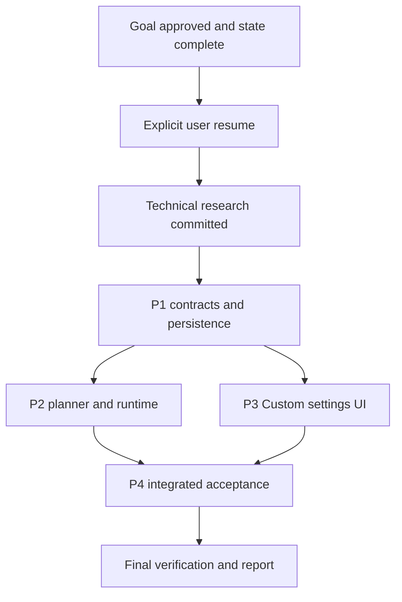

# State & Dependency Graph: Custom Learning Mode

## Workflow configuration

- Workspace: D:/Peter/A2UI. Shell: PowerShell.
- Keep all workflow artifacts directly in docs/custom-learning-mode/.
- Invocation configuration: MAW --skip review. Research remains required.
- Mandatory phases: brainstorming, planning, worker execution, and final
  verification. Technical research is enabled. Unified code review is skipped.
- Goal approval: user explicitly approved the written design on 2026-10-02.
  Approval persists; do not ask for it again when this workflow resumes.
- Execution is paused at the user's explicit request. Do not spawn, resume,
  or dispatch any agent until the user explicitly resumes MAW.
- After resume, research is the first phase. Do not dispatch planners before
  the research artifact is committed and its summary reconciled with this DAG.
- Orchestrator manages the workflow and documentation; subagents implement.
- Orchestrator MUST NOT read research.md or plan*.md. Verify their existence
  and commits with git log -1 --stat <hash>; use reported summaries to manage
  dependencies and pass artifact paths directly to the next agent.
- Available concurrency: four agents including orchestrator. Independent
  planners run concurrently; dispatch each ready worker immediately after its
  plan is committed and all worker dependencies are complete.
- Serialize git staging and commits in the shared checkout.
- Concurrent agents must use selective staging only, never `git add .`. If a
  git index lock or commit race occurs, wait and retry; do not force-reset.

## Workflow milestones

- [x] Step 1: Brainstorming & Goal Alignment (approved; 6123d6b)
- [x] Step 2: Technical Research (b900ed1)
- [x] Step 3: Planning Completed (plan1.md through plan4.md)
- [x] Step 4: Execution Completed (all workers and tests)
- [x] Step 5: Unified Code Review (Skipped via explicit --skip review request)
- [x] Step 6: Final Verification & Report (final_report.md)

## Brainstorming tasks

- [x] Explore source idea, specs, architecture, conventions, and recent commits.
- [x] Clarify requirements, scope, and exact concept-count semantics.
- [x] Compare settings row, dropdown controls, and modal approaches.
- [x] Recommend a compact settings row and present the design.
- [x] Write goal.md (5d9c80a) and self-check consistency, ambiguity, and scope.
- [x] Record explicit approval of the written goal and 1-30 count range
  (6123d6b).
- [x] Construct pre-research DAG, file ownership, exit gates, acceptance
  mapping, and resume procedure.
- [x] Record review skip and explicit pause; stop the researcher.

## Initial findings

- client/src/features/learning/TopicInput.tsx owns the mode dropdown and
  webSearchEnabled state. It currently offers Auto, Lite, and Full.
- client/src/types/learning.ts defines selected modes auto|lite|full and
  resolved modes lite|full. GenerateCourseRequest has no custom count.
- server/routers/learning.py contains GenerateCourseRequest.
- server/schemas/learning.py defines MODE_TOPIC_BOUNDS: lite 3-10, full 10-30;
  MAX_COURSE_TOPICS is 30. CourseOutline has schema and explicit validator
  minimums of three topics; both need to support 1/2-topic Custom outlines.
- server/agents/planner.py receives resolved modes, injects mode templates,
  and retries once when the outline violates the mode's bounds.
- server/services/depth_router.py resolves Auto through an LLM classifier.
- server/services/generation_runtime.py.start calls the generation job
  repository to create the shell and job. Resume restores persisted mode.
- The shell is created in server/database/generation_jobs.py and its Mongo
  counterpart server/database/repositories/mongo_jobs.py, through the
  GenerationJobRepository contract in repositories/protocols.py. Updating
  only LearningManager would miss the production shell creation path.
- server/graph/state.py checkpoints mode, resolved_mode, web_search_enabled,
  and topic_count. Requested count must remain distinct from actual count.
- server/graph/nodes.py already routes optional research using
  web_search_enabled and research_report_id.
- client/src/lib/learningApi.ts already accepts webSearchEnabled options and
  builds scoped search headers. Reuse this path and its credential boundary.
- SQLite and Mongo persistence are selected through repository facades.
- Relevant docs: ARCHITECTURE.md, STACK.md, TESTING.md, CONVENTIONS.md,
  STRUCTURE.md, INTEGRATIONS.md, CONCERNS.md, and learning-depth-modes/goal.md.

## Confirmed product decisions

- Auto intelligently chooses Lite or Full based on subject complexity.
- Lite supports simple subjects; Full supports larger, more detailed courses.
- Add Custom as a fourth mode without changing those existing semantics.
- In Custom, the user supplies an exact number of concept cards, 1-30.
- Count initially empty; valid integer input is required before submission.
- Show Number of concepts and Research controls in a settings row below the
  topic input only while Custom is selected.
- Research is optional and initially off. Its control and the existing globe
  use a single shared per-course value.
- When research capability is unavailable, show the Custom research control
  disabled with Settings guidance; research-off generation remains usable.
- Retain the entered count while switching modes in the mounted form; send
  it only for Custom. Preserve Auto as the initial mode.
- Custom bypasses automatic classification and enforces exact cardinality.
- Wrong-count outlines get one strict retry, then a durable generation error;
  do not silently accept, truncate, or pad a different count.
- Persist requested count and mode for both storage backends and resume.
- Skip unified review only. Keep research, TDD, build, lint, regressions,
  diagnostics, coverage verification, and final reporting.

## File preservation rules and shared-workspace safety

- There were 283 modified paths before this feature's implementation, largely
  existing header simplifications. They are user work; do not restore,
  overwrite, or inadvertently commit unrelated changes.
- Source example: TopicInput.tsx already has a seven-line header deletion.
  Other files have similar baseline edits, and learning.py also has a changed
  line. Do not assume every pending hunk belongs to Custom.
- Before editing, each worker records baseline diffs for its owned paths.
  Commit only feature hunks using selective staging; inspect the staged diff.
  If feature and baseline hunks overlap, coordinate with the orchestrator to
  stage the intended feature change without sweeping in user modifications.
- Never use git add . or broad directory staging for source code.
- Do not revert another agent's changes. Every worker is told it is not alone.
- Python: use server/.venv/Scripts/python.exe -m from repository root.
- New source files need mandatory 76-character separator headers. Use named
  TypeScript exports, strict types, and existing API/repository patterns.

## Dependency matrix & execution status

R means research completed and committed. P# worker prerequisites mean the
implementation and focused tests are complete and committed. All execution
below additionally requires explicit user resume.

| Plan | Title and scope | Worker prerequisites | Files/subsystems | Planner status | Worker status | Commits |
| --- | --- | --- | --- | --- | --- | --- |
| P1 | Contracts and persistence | R | TS/Pydantic contracts; SQLite/Mongo shell and session storage | Done (e2bfa9a) | Completed | 0f780e8, 0339020, 87612d4, 8d5e562, 290c6e8, c2c6681, f760787, 6cc100f |
| P2 | Planner and durable runtime | P1 | Depth resolution; exact-count planner; graph/start/resume | Done (7d710e6) | Completed | 5f7a283, e3ec1fe, a5155a4, 26837a8, 0232440, 30fb626, a5e96ab |
| P3 | Custom settings and API payload | P1 | TopicInput; learning API; focused client tests | Done (b53c884) | Completed | 9894886, f7ba756, 341b223, 8ae0889 |
| P4 | Integrated acceptance | P2, P3 | Cross-layer tests and verification evidence | Done (95c4d2b) | Completed | b5bb9bd, 1763781, cf64e72, 6b7b75d, 124b5ea, ed9cbaf |

### Execution graph

### Planner readiness and immediate worker dispatch

| Planner | Earliest planning prerequisites | Worker start condition |
| --- | --- | --- |
| P1 | User resume and R committed | plan1.md committed |
| P2 | P1 worker committed | plan2.md committed and P1 complete |
| P3 | P1 worker committed | plan3.md committed and P1 complete |
| P4 | P1 complete; P2/P3 plans committed | plan4.md committed; P2/P3 workers complete |

- P2/P3 planners run concurrently in the foreground; their workers own
  disjoint files and may run concurrently when ready.
- Start any ready worker immediately; do not wait for all planners.
- One agent at a time may stage/commit. Coordinate the shared git index.
- A changed upstream contract pauses affected downstream work until the
  contract, plans, and types are reconciled.
- Research may refine exact ownership and tests; update this state before
  dispatching planners, without changing approved product behavior.

## Plan scopes, file ownership, and completion gates

### P1 - Contracts and persistence

Deliverable: docs/custom-learning-mode/plan1.md and implementation commit(s).

Owned production files:
- client/src/types/learning.ts
- server/schemas/learning.py
- server/routers/learning.py (request model changes only)
- server/database/learning_persistence.py
- server/database/generation_jobs.py
- server/database/repositories/protocols.py
- server/database/repositories/mongo_learning.py
- server/database/repositories/mongo_jobs.py
- server/database/repositories/sqlite.py only if the adapter requires changes
- server/database/generation_migrations.py is NOT owned by P1; research
  confirmed no change is required there.

Owned existing tests: client/src/types/learning.test.ts;
server/tests/test_depth_mode_schema.py, test_depth_mode_persistence.py,
test_generation_jobs.py, test_mongo_jobs.py, test_mongo_learning.py, and
focused repository contract tests where needed.

Contract: add custom selected/resolved modes and optional custom_topic_count;
strict integer range 1-30, required for Custom and non-null rejected otherwise.
Allow general outline cardinality 1-30 while retaining per-mode validation.
Persist requested count independently of total_nodes on shell/session records;
existing records without the new field remain readable.

Exit gate: failing-then-passing request/schema tests, 1/2/30-topic schemas,
invalid-type/range tests, SQLite/Mongo session and shell round trips, existing
mode compatibility, and idempotent schema initialization/migration tests.

### P2 - Planner and durable runtime

Deliverable: docs/custom-learning-mode/plan2.md and implementation commit(s).

Owned production files: server/agents/planner.py,
server/services/depth_router.py, server/services/generation_runtime.py,
server/graph/state.py, server/graph/nodes.py, and server/graph/runner.py only
if necessary for start/resume state propagation.

Owned existing tests: server/tests/test_planner_mode.py, test_depth_router.py,
test_generation_runtime.py, test_staged_graph.py, test_graph.py, and focused
resume tests. Coordinate additional files before changing ownership.

Contract: Custom resolves to custom without a classifier call. Planner uses
an exact-count template and validation, with one retry and existing durable
failure mapping. Carry count through graph start/checkpoints/session restore.
Research true/false continues through the existing optional stage.

Exit gate: exact counts 1, 2, intermediate, and 30; bypassed classifier;
one retry and second-mismatch failure; stored count survives resume; research
on/off routing; existing Lite/Full/Auto and batching regressions pass.

### P3 - Custom settings and API payload

Deliverable: docs/custom-learning-mode/plan3.md and implementation commit(s).

Owned production files: client/src/features/learning/TopicInput.tsx and
client/src/lib/learningApi.ts only if request transport requires changes.
Owned tests: their co-located TopicInput.test.tsx and learningApi.test.ts.

Contract: show Custom in the existing dropdown, reveal accessible controls
below the input, validate count, share one research state with the globe,
handle unavailable capability, retain entered count across mode changes,
and omit custom_topic_count for other modes. Preserve progressive session
navigation and model/API-key gating; retain count/mode in seeded cache if
required by the extended session contract.

Exit gate: four options; count field only in Custom; exact payload; invalid
and empty counts blocked; shared research state and disabled guidance;
pending controls disabled; narrow viewport layout remains usable; tests,
TypeScript build, and relevant lint diagnostics pass.

### P4 - Integrated acceptance

Deliverable: docs/custom-learning-mode/plan4.md and integration commit(s).

Owned new tests: server/tests/test_custom_learning_mode_integration.py and
client/src/features/learning/__tests__/customLearningMode.test.tsx, adding
only tests that meaningfully prove cross-layer behavior. Use existing fixture
patterns and mocked external providers. Add mandatory headers to new files.

No unilateral edits to P1/P2/P3 production files. Coordinate defect fixes with
owners; integration verification is required even though review is skipped.

Exit gate: count and research choices survive UI/API/graph boundaries; durable
wrong-count failure is observable; resume and SQLite/Mongo contracts are
covered; existing modes pass regression. Record precise command outcomes.

## Acceptance coverage

| Goal criterion | Primary owners | Integrated verification |
| --- | --- | --- |
| AC1: Four dropdown modes | P3 | P4 client acceptance |
| AC2: Count and Research controls | P3 | P4 client acceptance |
| AC3: Exactly N topics, including 1/2/30 | P1, P2 | P4 server acceptance |
| AC4: Invalid count rejection | P1, P3 | P4 boundary tests |
| AC5: Research off/on stage selection | P2, P3 | P4 graph acceptance |
| AC6: Store parity and resumed count | P1, P2 | P4 persistence/resume acceptance |
| AC7: Existing modes remain compatible | All | Regression suites |
| AC8: TDD and quality gates | All | Final diagnostics/build/lint/coverage |

## Research reconciliation - COMPLETE

Artifact: docs/custom-learning-mode/research.md, commit b900ed1 (488 lines,
single-file commit verified with git log -1 --stat). Orchestrator verified the
commit metadata without reading the artifact; decisions below come from the
researcher's reported summary.

Recorded research decisions:
- Custom short-circuits `resolve_depth_mode` and must also be skipped in
  `server/graph/nodes.py:initialize_generation_node`; unknown modes otherwise
  silently fall back to lite.
- `CourseOutline.topics` has TWO independent minimum gates (schema
  `min_length` in server/schemas/learning.py:648 and the `validate_topics`
  check at line 655). Both must relax or 1/2-topic outlines fail before
  validation. New helper `validate_topic_count_for_mode(outline, mode,
  custom_topic_count=None)` centralizes per-mode checks.
- `server/agents/planner.py:521-526` `validate_complexity_distribution`
  errors on uniform complexity unconditionally; guard with `total >= 3`.
- Pydantic v2 coerces True->1, "5"->5, 2.5->2; request field must use
  `strict=True` with `ge=1, le=30` to satisfy AC4.
- Shell creation lives in server/database/generation_jobs.py and
  repositories/mongo_jobs.py, NOT LearningManager; SQLite/Mongo parity is
  mandatory for the new column.
- Batching, routing, graph topology, detached 202 generation, quizzes,
  cancellation, and regeneration already support 1- and 2-topic courses; no
  topology change is required.
- Secrets stay in scoped headers only (`X-Web-Search-Enabled`,
  `X-Tavily-Key`); never persisted in CourseState or the database.

Baseline evidence captured by the researcher:
- server: focused depth-mode/planner/runtime/graph suite = 53 tests OK.
- client: TopicInput, learningApi, and learning types = 19 tests passed.
- Known blocker: `test_course_outline_rejects_2_topics` in
  server/tests/test_depth_mode_schema.py:55-58 encodes the old minimum and
  must be rewritten by P1.

DAG and ownership adjustments accepted:
1. Remove server/database/generation_migrations.py from P1 ownership; research
   confirms no change is needed there.
2. `client/src/lib/learningApi.ts` is now unconditional P3 ownership, since
   the POST body must carry `custom_topic_count`.
3. P2 and P3 have zero file overlap and may run fully concurrently once P1
   commits.
4. Complexity-distribution guard is an explicit P2 contract item.

Reusable test helpers planners and workers should follow are listed in
research.md, notably `_topic`/`_outline` factories in
test_depth_mode_schema.py, the AsyncMock `side_effect` replan pattern in
test_planner_mode.py, the TemporaryDirectory LearningManager pattern in
test_depth_mode_persistence.py, `make_job_document` in test_mongo_jobs.py,
and the `renderInput`/vi.hoisted harness in TopicInput.test.tsx.

## Final verification commands and evidence

| Working directory | Command | Purpose/status |
| --- | --- | --- |
| repository root | server/.venv/Scripts/python.exe -m unittest | PASS: 452 tests, OK, exit 0, 99.4s |
| client | npm run test -- --run | PASS: 229 tests across 34 files, exit 0 |
| client | npm run build | PASS: exit 0, built in 21.62s |
| client | npm run lint | PASS: exit 0, 0 errors, 3 pre-existing warnings in gitignored client/coverage/ |
| client | npm run test:generation:coverage | FAIL exit 1, PRE-EXISTING and independent (see note) |
| client | Focused Vitest coverage for changed files | PASS: TopicInput.tsx 265/268 new lines (98.88%), learningApi.ts 9/9 (100%) |
| repository root | Backend coverage via stdlib trace | PASS: 110/110 new statements (100% line coverage) |
| repository root | git diff --check -- <owned paths> | PASS: exit 0 for the two P4 new files |

Pre-existing coverage failure disposition: `npm run test:generation:coverage`
fails because GenerationStatusPanel.tsx branch coverage is 80% against an 81%
per-file threshold. All 229 client tests still pass. This is provably
independent of custom-learning-mode: client/vitest.generation.config.ts limits
its coverage include list to eight files, none of which this feature modified
(TopicInput.tsx and learningApi.ts are not in that list), and `git log
5d9c80a..HEAD` shows no commits touching GenerationStatusPanel.tsx,
GenerationStatusPanel.test.tsx, or vitest.generation.config.ts. Excluding the new
P4 test file reproduces the identical failure. That file belongs to the separate
Phase 7 progressive generation work and was deliberately not patched here.

Baseline notes superseded: both suites were re-run after resume and both now
pass cleanly. The earlier interrupted baseline is no longer in effect.

## Artifact and commit record

| Artifact/action | State | Commit/evidence |
| --- | --- | --- |
| goal.md and initial state.md | Written | 5d9c80a |
| Goal approval record | Approved | 6123d6b |
| Complete state and pause handoff | Paused, then resumed by user | 5becaf9, 955b769 |
| research.md | Written and reconciled | b900ed1 |
| plan1.md | Written | e2bfa9a |
| plan2.md | Written | 7d710e6 |
| plan3.md | Written | b53c884 |
| plan4.md | Written | 95c4d2b |
| Implementation | Complete | P1-P3 worker commits listed in the dependency matrix |
| review.md | Skipped by explicit user request | No reviewer was spawned |
| final_report.md | Written | Current documentation checkpoint commit |

## Current gate and resume procedure

CURRENT GATE: COMPLETE. ALL MILESTONES DONE, ACCEPTANCE MET.

1. ~~Wait for explicit user resume~~ Done 2026-10-02; goal approved; --skip review honoured throughout.
2. ~~Read goal.md and this state, check git status~~ Done; 284 user modifications preserved throughout.
3. ~~Record status in-progress and resume_gate resumed~~ Done (955b769).
4. ~~Researcher dispatched and research.md committed~~ Done (b900ed1).
5. ~~Verify commit, reconcile ownership/DAG, mark research complete~~ Done (80b2093).
6. ~~Dispatch P1 planner then P1 worker~~ Done (e2bfa9a; 8 worker commits).
7. ~~Dispatch P2/P3 planners concurrently, pipeline workers~~ Done (7d710e6, b53c884; 7 and 4 worker commits).
8. ~~Plan and execute P4~~ Done (95c4d2b; 6 commits). No defects found in P1/P2/P3 code. No reviewer was dispatched, per --skip review.
9. ~~Run final checks and coverage verification~~ Done; results recorded above and in final_report.md.
10. ~~Commit workflow documentation and add git notes~~ Done; see the artifact record and commit notes.

Follow-up carried forward (not part of this feature):
- `npm run test:generation:coverage` fails on GenerationStatusPanel.tsx branch
  coverage (80% vs 81%). Pre-existing Phase 7 work, deliberately not patched.
