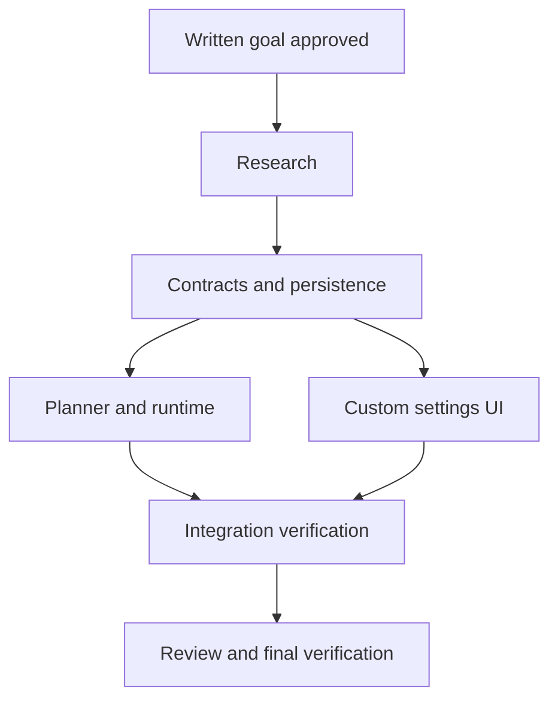

# State & Dependency Graph: Custom Learning Mode

## Workflow configuration

- Keep workflow artifacts directly in docs/custom-learning-mode/.
- No phases skipped. Brainstorming, research, planning, execution, review,
  and final verification are required.
- Authorization: draft the specification now; obtain MAW's explicit written
  goal approval before dispatching research/planning/implementation agents.
- Preserve the many existing uncommitted client/server changes. Stage only
  explicitly owned paths; serialize all commits in the shared checkout.

## Workflow milestones

- [ ] Step 1: Brainstorming & Goal Alignment (goal.md proposed)
- [ ] Step 2: Technical Research (research.md)
- [ ] Step 3: Planning Completed
- [ ] Step 4: Execution Completed
- [ ] Step 5: Unified Code Review (review.md)
- [ ] Step 6: Final Verification & Report (final_report.md)

## Brainstorming tasks

- [x] Explore context, specifications, recent commits, and current modes.
- [x] Capture count and research requirements from user.
- [x] Compare UI approaches and recommend a settings row.
- [x] Write proposed goal; review consistency, scope, and count enforcement.
- [ ] Obtain user approval of the written goal and proposed 1–30 range.
- [x] Construct initial DAG, ownership, and acceptance mapping.

## Initial findings

- TopicInput.tsx owns the depth dropdown and per-course web-search state.
- Existing modes are auto, lite, and full; resolved modes are lite and full.
- CourseOutline currently requires at least 3 topics; the maximum is 30.
- Planner retries once after an outline violates mode bounds.
- GenerationRuntime persists session mode and restores it on resume.
- Graph research routing already uses web_search_enabled.
- Repository facades support both SQLite and MongoDB persistence.

## Confirmed product decisions

- User requested Custom, an explicit concept count, and research on/off.
- Proposed details awaiting approval: settings row, range 1–30, empty initial
  count, and reuse of the existing research setting.

## Dependency matrix & execution status

R is committed technical research. Reconcile exact ownership after research.

| Plan | Scope | Worker dependencies | Planner | Worker | Commits |
| --- | --- | --- | --- | --- | --- |
| P1 | Contracts and persistence | R | Pending | Pending | — |
| P2 | Planner and durable runtime | P1 | Pending | Pending | — |
| P3 | Custom UI and request flow | P1 | Pending | Pending | — |
| P4 | Integration verification | P2, P3 | Pending | Pending | — |

### Execution graph

### Planner readiness and immediate worker dispatch

- P1 planning starts after R; its worker starts after plan1.md is committed.
- P2/P3 planners run concurrently after P1 implementation is committed.
- Dispatch each ready P2/P3 worker as soon as its plan is committed.
- P4 planning may begin after P2/P3 plans are committed; execution waits for
  both workers to finish. Serialize mutations to shared files and git index.
- Pause affected downstream work if an upstream contract changes.

## Plan scopes, file ownership, and completion gates

### P1 — Contracts and persistence

Own client/src/types/learning.ts, server/schemas/learning.py, request schema
in server/routers/learning.py, server/database/learning_persistence.py,
server/database/repositories/{protocols,mongo_learning,sqlite}.py as needed,
and focused contract/persistence tests. Exit: valid custom requests, strict
count validation, 1/2-topic outlines, store parity, and existing mode tests.

### P2 — Planner and durable runtime

Own server/agents/planner.py, server/services/depth_router.py,
server/services/generation_runtime.py, server/graph/{state,nodes,runner}.py
as needed, and corresponding planner/runtime tests. Exit: exact count,
one retry, durable failure, research selection, and resume restoration.

### P3 — Custom UI and request flow

Own client/src/features/learning/TopicInput.tsx, its co-located tests,
client/src/lib/learningApi.ts and its tests if required. Exit: four options,
accessible settings and validation, correct count payload, synchronized
research control, and narrow viewport compatibility.

### P4 — Integration verification

Own narrowly scoped integration tests and verification artifacts. Coordinate
any changes to upstream files with their owners. Exit: Custom count and
research selection proven across UI/API/graph, plus existing mode regression.

## Acceptance coverage

| Goal criterion | Owner | Integrated verification |
| --- | --- | --- |
| Dropdown and settings | P3 | P4, client tests |
| Exact count and rejection | P1, P2, P3 | P4 |
| Research on/off | P2, P3 | P4 |
| Persistence and resume | P1, P2 | P4 |
| Existing mode compatibility | All | Regression suites |

## Research handoff

Pending approval. Research agent must verify official documentation for any
unfamiliar library patterns and commit research.md; orchestrator consumes its
reported summary and commit metadata, without reading research.md or plans.

## Final verification commands and evidence

| Directory | Command | Purpose |
| --- | --- | --- |
| client | npm run test -- --run | Client regression |
| client | npm run build | TypeScript and Vite build |
| client | npm run lint | ESLint diagnostics |
| repository root | server/.venv/Scripts/python.exe -m unittest | Backend regression |
| client/server | Focused coverage commands selected by planners | New-code coverage |

Evidence pending execution. Track baseline failures separately.

## Artifact and commit record

| Artifact | State | Commit |
| --- | --- | --- |
| goal.md | Proposed | Initial specification commit |
| state.md | Awaiting goal approval | Initial specification commit |
| research.md | Pending | — |
| plan1.md through plan4.md | Pending | — |
| review.md | Pending | — |
| final_report.md | Pending | — |

## Current gate and resume procedure

CURRENT GATE: WAITING FOR WRITTEN GOAL APPROVAL.

1. Read this state, goal, and git status; preserve intervening user changes.
2. Obtain explicit goal approval, or incorporate requested revisions.
3. Record authorization and dispatch the research agent.
4. Reconcile DAG from research summary; dispatch ready planners/workers.
5. Review, fix defects, verify, and commit the final report.
